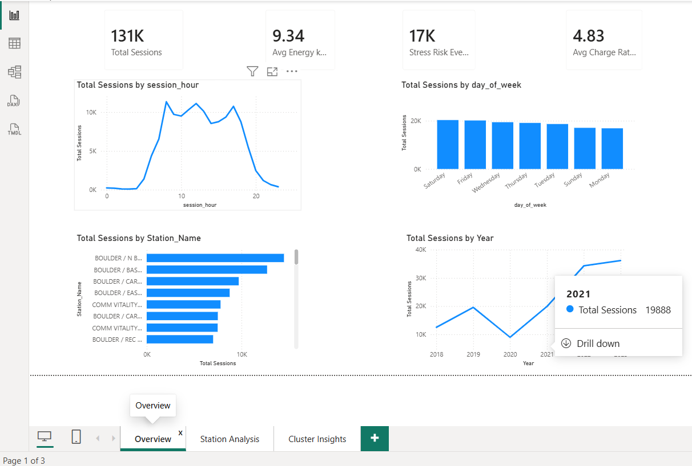
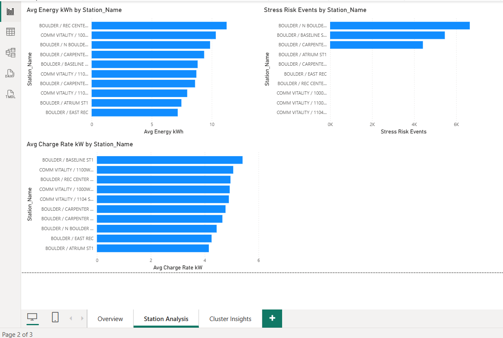
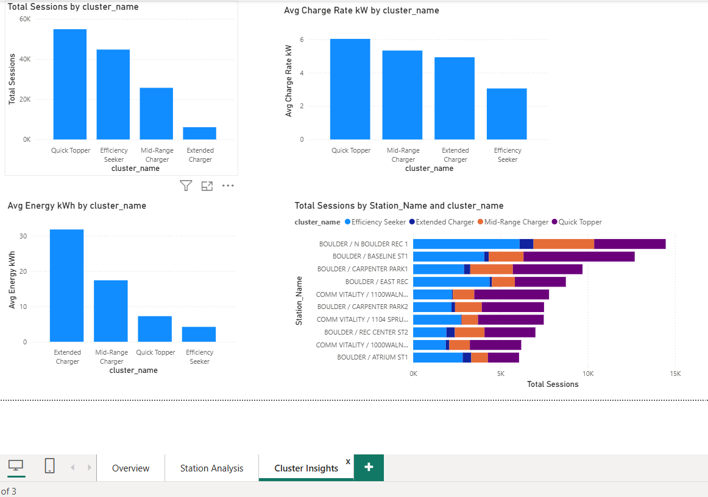

# EV Fleet Operations Analytics Dashboard

End-to-end analytics on 131,419 real EV charging sessions from the City of Boulder open data portal (2018–2023).

---

## Problem statement
Boulder's municipal EV charging network lacks visibility into usage patterns, station stress points, and user behaviour — making infrastructure planning reactive rather than proactive.

---

## Tech stack
| Tool | Purpose |
|------|---------|
| Python (pandas, scikit-learn, matplotlib, seaborn) | Cleaning, EDA, modeling |
| SQL (SQLite) | Aggregation, EDA queries, validation |
| Power BI | Interactive 3-page dashboard |

---

## Dataset
**Source:** City of Boulder Open Data Portal  
**Size:** 131,419 sessions · 20 columns · 2018–2023  
**Link:** https://open-data.bouldercolorado.gov

---

## Key findings
- Peak demand occurs 10am–12pm and 3–5pm on weekdays
- N Boulder Rec 1 handles 14,471 sessions — nearly 2x the next busiest station
- 4 user segments via K-Means: Quick Topper (41.7%), Efficiency Seeker (34%), Mid-Range Charger (19.6%), Extended Charger (4.7%)
- Extended Chargers average 31.8 kWh per session — primary range anxiety group
- Station stress risk classifier achieved ROC-AUC of 0.84
- Identified and resolved target leakage twice during model development

---

## Business recommendations
1. Deploy additional ports at N Boulder Rec 1 before 10am weekdays to reduce peak utilization
2. Target Extended Charger segment with pre-arrival charging reservation system
3. Investigate underperforming charge rates at East Rec and Atrium ST1

---

## Dashboard preview

### Overview

### Station Analysis

### Cluster Insights

---

## Author
**Dhananjay Lingam** | Mechanical Engineering (EV specialization) → Data Analytics  
[LinkedIn](https://www.linkedin.com/in/dhananjaylingam/)
---

## Project structure

ev-fleet-analytics/

│

├── EV_Fleet_Analytics.ipynb   # Full analysis notebook

├── ev_fleet_final.csv         # Cleaned enriched dataset

├── overview.png               # Dashboard — Overview page

├── station_analysis.png       # Dashboard — Station Analysis page

├── cluster_insights.png       # Dashboard — Cluster Insights page

└── README.md
